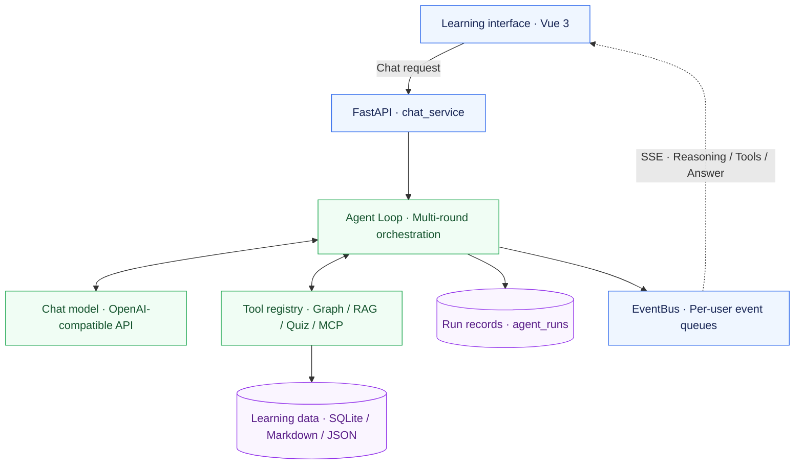

# <center> *TutorAgent* — A knowledge-graph-driven adaptive tutoring agent </center>

[简体中文](README.md) ｜ **English**

<p align="center">
  An AI study companion for university students, connecting conversation, knowledge structure, and learning feedback.
</p>

<p align="center">
  <a href="LICENSE"></a>
  <a href="backend/requirements.txt"></a>
  <a href="frontend/package.json"></a>
  <a href="backend/requirements.txt"></a>
</p>

<p align="center">
  <a href="#overview">Overview</a> ·
  <a href="#architecture">Architecture</a> ·
  <a href="#quick-start">Quick start</a> ·
  <a href="#configuration">Configuration</a> ·
  <a href="#documentation">Docs &amp; support</a> ·
  <a href="CONTRIBUTING.md">Contribute</a>
</p>

---

<a id="overview"></a>

## Overview

TutorAgent connects **conversational tutoring, a knowledge graph, learner profiles, and learning paths**. Start with a question, add textbooks to your knowledge base, build structured notes as you learn, and check your understanding through quizzes.

| Self-study challenge | How TutorAgent helps |
| :--- | :--- |
| Disconnected topics and unclear prerequisites | Visualize knowledge relationships and follow learning paths based on prerequisites |
| Understanding an explanation without knowing whether you can solve a problem | Use AI quizzes and grading to update mastery and inspect weak areas in the dashboard |
| Conversations and notes scattered across tools | Save learning content in graph nodes and learner profiles for future tutoring |

**A typical session:** choose a subject or topic → learn through conversation → take a quiz → review your graph and progress → continue to the next step.

<a id="architecture"></a>

## Architecture

**The Agent Loop runs the conversation**: the model calls tools as needed and then produces an answer. Reasoning, tool progress, and answer text reach the frontend through SSE (server-sent events).



| Feedback loop | Data flow |
| :--- | :--- |
| **Learning and feedback** | Tutoring → background quiz generation → answers and grading → mastery updates → learning path adjustments |
| **Resources and retrieval** | Upload or collect resources → parse and chunk → vector and BM25 indexes → hybrid retrieval → source citations in conversation |
| **Execution and replay** | Generate a `run_id` → display live events → persist evidence → retrieve and review a run by ID |

<details>
<summary>Plain-text architecture and developer entry points</summary>

```text
Vue 3 frontend
  | REST / SSE
FastAPI -> chat_service -> Agent Loop <-> Chat model
                              | Tool calls
                     Graph / Profile / RAG / Quiz / MCP
                              | Persistence
                     SQLite / Markdown / JSON
```

Entry points: [chat orchestration](backend/app/services/chat_service.py), [Agent Loop](backend/app/core/agent_loop.py), and [tool registry](backend/app/core/agent_tools.py). See [AGENTS.md](AGENTS.md) for internal contracts and coupling constraints.

</details>

## Core features

| Feature | Description | Status |
| :--- | :--- | :---: |
| Adaptive conversation | Adaptive guidance, free conversation, and recursive teaching; multi-round tool calls | ✅ |
| Knowledge graph and learning paths | D3 force-directed graph, subject and board views, mastery colors, prerequisites, and path recommendations | ✅ |
| Learner profile and dashboard | Record goals, preferences, and teaching notes; display mastery and weak areas | ✅ |
| File knowledge base | Tree-based management; parse PDF, Word, PPT, text, and images, with OCR requiring its components | ✅ |
| Hybrid retrieval and Agentic RAG | Fuse vector search with BM25; the model uses `rag_search` to query the graph and knowledge base as needed | ✅ |
| Textbook-to-graph generation | Extract knowledge nodes from textbooks in the knowledge base with semantic deduplication | ✅ |
| AI quizzes and grading | Multiple question types in the quiz bank; background objective quizzes in chat with deterministic mastery updates after correct answers | ✅ |
| Web search and resource collection | MCP web search, webpage extraction, resource downloads into the knowledge base, and Collector ingestion | ✅ |
| Run records and model fallback | Save reasoning and tool evidence by `run_id`; support failure fallback when a backup service is configured | ✅ |
| User isolation and resource filtering | JWT authentication, per-user data, and resource license filtering for personal or commercial mode | ✅ |

## Tech stack

| Layer | Technology | Purpose |
| :--- | :--- | :--- |
| Frontend | Vue 3 · Vite 8 · Pinia · Element Plus · D3 | Conversation, graph, and dashboard; Markdown / LaTeX rendering |
| Backend | FastAPI · Uvicorn · Jinja2 | REST API, SSE events, and prompt templates |
| Conversation and tools | OpenAI-compatible API · MCP | Template preset: `MiniMax-M3`; configurable model, endpoint, and key |
| Embeddings and retrieval | text-embedding-v4 · Whoosh BM25 · RRF | Independent embedding service and hybrid retrieval |
| Document parsing | PyMuPDF · python-docx · python-pptx · RapidOCR | Format-specific parsing and OCR |
| Storage and authentication | SQLite · Markdown · JSON · JWT · bcrypt | Local persistence, authentication, and user isolation |
| Deployment | Docker Compose · Nginx | Single-container deployment, SSE proxying, and data volumes |

<a id="quick-start"></a>

## Quick start

### 1. Prepare your environment

| Dependency | Requirement |
| :--- | :--- |
| Python | 3.10+; repository CI uses 3.13 |
| Node.js | `^20.19.0` or `>=22.12.0`, matching Vite in the frontend lockfile |
| Model services | Chat model API key; an Alibaba Cloud Bailian key for embeddings and knowledge-base retrieval |
| Database | SQLite; no separate database server required |

Download the repository and enter its root directory. To contribute, fork first and clone your own fork.

```bash
git clone https://github.com/qiyuxi24/AI-tutor.git
cd AI-tutor
```

### 2. Install and configure (Windows PowerShell)

The installer creates the virtual environment and installs backend and frontend dependencies. It also creates the root `.env` from the template if the file does not exist.

```powershell
.\install.ps1
notepad .env
```

Set `LLM_API_KEY`, `DASHSCOPE_API_KEY`, and `SECRET_KEY` in `.env`. The chat model, endpoint, and key must belong to the same service; see [configuration](#configuration). Generate a random signing key with the following command, then paste the output into `SECRET_KEY`:

```powershell
.\backend\venv\Scripts\python.exe -c "import secrets; print(secrets.token_hex(32))"
```

> [!IMPORTANT]
> Keep configuration in the root `.env` and use the project virtual environment for the backend. When starting Uvicorn manually, explicitly set `--workers 1`; per-user event queues require a single process.

### 3. Start and explore

```powershell
.\start.ps1
```

| Entry point | Address and expected result |
| :--- | :--- |
| Learning interface | [localhost:5173](http://localhost:5173) |
| API documentation | [localhost:8000/docs](http://localhost:8000/docs), with request and response schemas |
| Health check | [localhost:8000/api/health](http://localhost:8000/api/health), returning `{"status":"ok"}` |

Register an account on first use. To create `admin` at startup, set `DEFAULT_ADMIN_PASSWORD` first; leaving it empty does not create an administrator automatically.

After signing in, choose a topic and ask “Help me map the prerequisites for this topic” to explore conversation and graph updates.

<details>
<summary>Manual development: Windows PowerShell</summary>

Run these commands from the repository root. If the virtual environment and dependencies already exist, proceed directly to starting the services.

```powershell
python -m venv backend/venv
.\backend\venv\Scripts\python.exe -m pip install -r backend/requirements.txt
npm --prefix frontend ci
if (-not (Test-Path .env)) { Copy-Item .env.example .env }
notepad .env
```

Backend terminal:

```powershell
cd backend
.\venv\Scripts\python.exe -m uvicorn app.main:app --reload --reload-dir app --port 8000 --workers 1
```

Frontend terminal, opened at the repository root:

```powershell
npm --prefix frontend run dev
```

</details>

<details>
<summary>Manual development: Linux / macOS</summary>

Run these commands from the repository root. After creating `.env`, fill in the configuration above with your editor.

```bash
python3 -m venv backend/venv
backend/venv/bin/python -m pip install -r backend/requirements.txt
npm --prefix frontend ci
test -f .env || cp .env.example .env
```

Backend terminal:

```bash
cd backend
venv/bin/python -m uvicorn app.main:app --reload --reload-dir app --port 8000 --workers 1
```

Frontend terminal, opened at the repository root:

```bash
npm --prefix frontend run dev
```

</details>

<details>
<summary>Docker Compose deployment</summary>

Configure the model service, `DASHSCOPE_API_KEY`, and `SECRET_KEY` in the root `.env`, then run:

```bash
docker compose up -d --build
docker compose ps
```

Open [localhost:8080](http://localhost:8080) locally, or the server address for a remote deployment. Set `PORT` to change the exposed port. Compose mounts graph, conversation, profile, and `backend/data` directories; prompt templates ship with the image. See the [operations guide](docs/运维_生产上线与日常运营指南.md) for deployment, backups, and troubleshooting.

</details>

<a id="configuration"></a>

## Configuration

Template: [.env.example](.env.example) · Loader: [config.py](backend/app/core/config.py). The table distinguishes template presets from code defaults; these files define the complete set of options.

| Variable | Required? | Description |
| :--- | :--- | :--- |
| `LLM_API_KEY` | For conversation | Chat service key; if empty, uses `DASHSCOPE_API_KEY`, with a matching endpoint and model required |
| `LLM_BASE_URL` | Match the model | Template preset: `https://api.minimaxi.com/v1`; when this variable is unset, code defaults to the Bailian-compatible endpoint |
| `MODEL_NAME` | Match the endpoint | Template preset: `MiniMax-M3`; when this variable is unset, code defaults to `qwen-plus` |
| `DASHSCOPE_API_KEY` | Embeddings / Docker | Alibaba Cloud Bailian key for the fixed `text-embedding-v4` model |
| `SECRET_KEY` | Yes | JWT signing key; the service refuses to start without it |
| `DEFAULT_ADMIN_PASSWORD` | Optional | Password for initial `admin` creation; an empty value skips creation and does not change existing passwords |

<details>
<summary>Advanced configuration: fallback, retrieval, context budget, and deployment</summary>

| Variable | Required? | Description |
| :--- | :--- | :--- |
| `EMBED_BASE_URL` | Optional | Defaults to `https://dashscope.aliyuncs.com/compatible-mode/v1`, independent of the chat model |
| `FALLBACK_LLM_API_KEY` | Optional | Backup service key; uses `DASHSCOPE_API_KEY` if empty |
| `FALLBACK_LLM_BASE_URL` / `FALLBACK_MODEL_NAME` | Optional | Configure both with an available key to enable the backup service |
| `WEB_SEARCH_ENABLED` | Optional | Defaults to `true`; set to `false` to disable MCP web search |
| `SEARXNG_URL` | Optional | Self-hosted SearXNG URL; uses ddgs when unset |
| `LLM_CTX_BUDGET` | Optional | Conversation request budget; defaults to `32000` tokens |
| `GRAPH_INJECT_MAX_CHARS` | Optional | Graph context character limit; defaults to `12000`, with `0` meaning unlimited |
| `LLM_TIMEOUT` | Optional | Model request timeout; defaults to `120` seconds |
| `CORS_ALLOW_ORIGINS` / `PORT` | Optional | Allowed cross-origin sources and Docker host port; the latter defaults to `8080` |

</details>

> [!NOTE]
> When switching chat services, update `LLM_API_KEY`, `LLM_BASE_URL`, and `MODEL_NAME` together. Embeddings are configured separately; clearing the chat key alone does not switch the endpoint.

## Project structure

```text
AI-tutor/
├── frontend/src/             # Vue views, components, Pinia, and SSE client
├── backend/
│   ├── app/api/v1/           # HTTP routes
│   ├── app/services/         # Chat orchestration
│   ├── app/core/             # Agent, graph, profile, RAG, quizzes, and collection
│   ├── app/mcp_servers/      # MCP servers
│   ├── tests/                # Unit and integration tests
│   └── scripts/              # Diagnostics, smoke tests, and evaluation
├── data/prompts/             # Version-controlled Jinja2 prompt templates
├── docs/                     # Design, research, and operations documentation
├── .github/workflows/        # GitHub Actions
├── .env.example              # Configuration template
├── docker-compose.yml        # Container orchestration
├── CONTRIBUTING.md           # Development, validation, and PR conventions
└── AGENTS.md                 # Architecture contracts and developer index
```

Runtime graph, profile, conversation, and uploaded resource data are stored per user. Commit prompt templates while excluding `.env`, runtime data, and dependency directories.

## Quality and tests

Run the backend offline tests before submitting changes. All PowerShell commands below use the **repository root** as the working directory:

```powershell
.\backend\venv\Scripts\python.exe -m pip install -r backend/requirements-dev.txt
.\backend\venv\Scripts\python.exe -m pytest backend/tests -q -m "not llm_api"
```

| Check | Scope and interpretation |
| :--- | :--- |
| Backend offline tests | Graph, retrieval, user isolation, and Agent execution; use the current run output for counts and results |
| [GitHub Actions](.github/workflows/backend-tests.yml) | CI runs the same offline suite on Python 3.13 |
| Frontend build | Run `npm --prefix frontend run build` from the root |
| Live model tests | Marked `llm_api`; require valid API keys and the relevant test dependencies, and run separately |

Offline tests replace LLM / embedding network calls while exercising real chunking, retrieval, and orchestration logic. They do not establish teaching quality or semantic retrieval performance with real models.

<details>
<summary>Retrieval evaluation and in-chat quiz smoke test</summary>

Run the CMRC2018 retrieval evaluation from the repository root, using deterministic mock embeddings to compare retrieval strategies:

```powershell
.\backend\venv\Scripts\python.exe backend/scripts/eval_rag.py --embed mock
```

Use `--embed api` for real embeddings. See [smoke_chat_quiz.py](backend/scripts/smoke_chat_quiz.py) for end-to-end in-chat quiz validation; live service calls consume API quota. Evaluation methodology and technical evidence are described in the [technical report](docs/国创技术报告.md).

</details>

<a id="documentation"></a>

## Documentation and support

| What you need | Read next |
| :--- | :--- |
| Development setup, commit conventions, and contribution workflow | [Contribution guide](CONTRIBUTING.md) |
| Module responsibilities, tool integration, and architecture contracts | [Developer handbook](AGENTS.md) |
| API parameters and responses | [FastAPI /docs](http://localhost:8000/docs) after starting the backend |
| Agent design | [Agent Loop design](docs/AgentLoop_重构设计讨论.md) |
| Knowledge base and quizzes | [RAG learning path](docs/RAG_参考资料与学习路线.md) · [Quiz design](docs/QUIZ_出题逻辑调研.md) |
| Web tools | [MCP web search design](docs/MCP_网页搜索工具_调研与实施方案.md) |
| Deployment and operations | [Docker guide](docs/Docker_学习路径与工程化部署.md) · [Operations guide](docs/运维_生产上线与日常运营指南.md) |
| Git collaboration and bilingual documentation | [Git workflow](docs/Git_多人协作_工作流调研与学习路径.md) · [README conventions](docs/README_编写规范.md) |

For help, search existing [Issues](https://github.com/qiyuxi24/AI-tutor/issues), then report your OS and runtime versions, reproduction steps, expected results, and logs with secrets removed. The project is maintained by [qiyuxi24](https://github.com/qiyuxi24) and [community contributors](https://github.com/qiyuxi24/AI-tutor/graphs/contributors); see [Pull requests](https://github.com/qiyuxi24/AI-tutor/pulls) for development discussions.

## Contributing

Bug reports, documentation fixes, tests, and feature improvements are welcome. Read [CONTRIBUTING.md](CONTRIBUTING.md) first and follow **Fork → local branch → validate and commit → Push → PR**. Update both README languages whenever structure, commands, or facts change.

## License

This project is licensed under the [MIT License](LICENSE).

<p align="right"><a href="#tutoragent">Back to top ↑</a></p>
