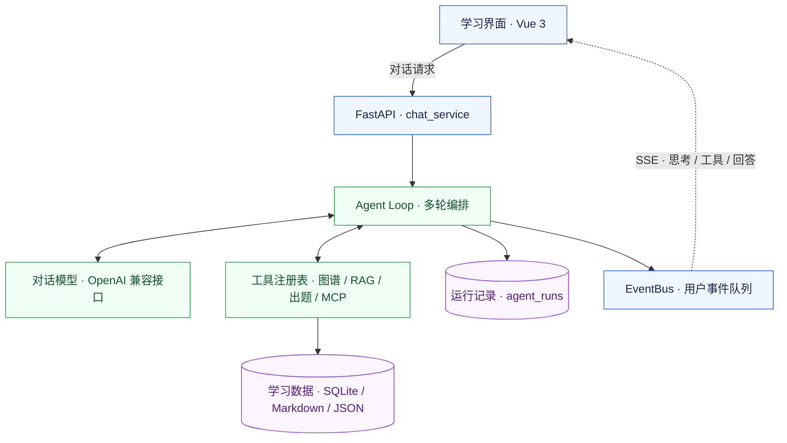

# <center> *TutorAgent* — 知识图谱驱动的自适应导学 Agent </center>

**简体中文** ｜ [English](README.en.md) 

<p align="center">
  面向大学生的 AI 学习伙伴：不止是问答，而是<b>有地图（知识图谱）、有路径（学习规划）、有记忆（学情画像）、有反馈（AI 出题 + 进度仪表盘）</b> 的主动学习系统。
</p>

<p align="center">
  <a href="LICENSE"></a>
  <a href="backend/requirements.txt"></a>
  <a href="frontend/package.json"></a>
  <a href="backend/requirements.txt"></a>
</p>

<p align="center">
  <a href="#overview">项目简介</a> ·
  <a href="#architecture">架构全景</a> ·
  <a href="#quick-start">快速开始</a> ·
  <a href="#configuration">配置说明</a> ·
  <a href="#documentation">文档与支持</a> ·
  <a href="CONTRIBUTING.md">参与贡献</a>
</p>

---

<a id="overview"></a>

## 项目简介

TutorAgent 将 **对话式 AI 家教、知识图谱、学情画像和学习路径** 结合起来。让 AI 从"你问我答"升级为主动导学：它记得你学过什么、看得见知识全貌、能规划下一步学什么，并自动把聊天沉淀成结构化笔记。你可以从一个问题开始学习，把教材放进知识库，在对话中积累结构化笔记，再通过出题自测获得反馈。

| 自学时的困扰 | TutorAgent 的做法 |
| :--- | :--- |
| 知识点零散，不知道先学什么 | 用可视化图谱呈现知识关系，按先修关系推荐学习路径 |
| 感觉听懂了，却不知道能否独立作答 | 通过 AI 出题与判分更新掌握度，在仪表盘查看薄弱点 |
| 对话和笔记分散，复习时难以找回 | 将学习内容沉淀为图谱节点和学情画像，供后续教学使用 |

相比通用对话工具（ChatGPT / Kimi）"对话完即忘"、知识管理工具（Notion / Obsidian）"只存不教"、MOOC 平台"千人一面"，TutorAgent 将**对话交互、知识图谱、学情画像、路径推荐**融为一体——它是主动的学习伙伴，不是被动的问答工具。

<a id="architecture"></a>

## 架构全景

**Agent Loop 是对话的主执行链路**：模型按需调用工具，再生成回答；思考、工具进度与回答文本通过 SSE（服务器发送事件）实时传回前端。



| 闭环 | 数据如何流动 |
| :--- | :--- |
| **学习与反馈** | 对话教学 → 后台出题 → 学生作答与判分 → 更新掌握度 → 调整学习路径 |
| **资料与检索** | 上传或采集资料 → 解析分块 → 向量与 BM25 索引 → 混合检索 → 在对话中引用来源 |
| **运行与回放** | 一次对话生成 `run_id` → 事件实时展示 → 运行记录保存证据 → 按 ID 查询与复核 |

<details>
<summary>查看纯文本架构与开发入口</summary>

```text
Vue 3 前端
  | REST / SSE
FastAPI -> chat_service -> Agent Loop <-> 对话模型
                              | 工具调用
                     图谱 / 画像 / RAG / 出题 / MCP
                              | 持久化
                     SQLite / Markdown / JSON
```

核心入口：[对话编排](backend/app/services/chat_service.py)、[Agent Loop](backend/app/core/agent_loop.py)、[工具注册表](backend/app/core/agent_tools.py)。Agent开发见 [AGENTS.md](AGENTS.md)。

</details>

## 核心功能

| 功能 | 说明 | 状态 |
| :--- | :--- | :---: |
| 自适应对话 | 自适应引导、自由对话、递归式教学三种模式；支持多轮工具调用 | ✅ |
| 知识图谱与学习路径 | D3 力导向图、学科与板块切片、掌握度着色、先修关系与路径推荐 | ✅ |
| 学情画像与仪表盘 | 记录目标、偏好与教学笔记，展示掌握度和薄弱点 | ✅ |
| 文件知识库 | 目录树管理；解析 PDF、Word、PPT、文本及图片，OCR 能力依赖相应组件 | ✅ |
| 混合检索与 Agentic RAG | 向量检索与 BM25 融合；模型通过 `rag_search` 按需查询图谱和知识库 | ✅ |
| 教材生成图谱 | 从知识库教材提取知识节点，并进行语义去重 | ✅ |
| AI 出题与判分 | 题库支持多种题型；对话内客观题异步生成，答对后确定性更新掌握度 | ✅ |
| 联网搜索与资料采集 | MCP 网页搜索、网页正文抓取、资源下载入库与 Collector 采集 | ✅ |
| 运行记录与模型回退 | 按 `run_id` 保存思考与工具证据；配置备用服务后支持失败回退 | ✅ |
| 用户隔离与资料过滤 | JWT 认证；用户数据隔离；按个人或商用模式过滤资料许可等级 | ✅ |

## 技术栈

| 层级 | 技术 | 用途 |
| :--- | :--- | :--- |
| 前端 | Vue 3 · Vite 8 · Pinia · Element Plus · D3 | 对话、图谱与仪表盘，Markdown / LaTeX 渲染 |
| 后端 | FastAPI · Uvicorn · Jinja2 | REST API、SSE 事件流与提示词模板 |
| 对话与工具 | OpenAI 兼容接口 · MCP | 模板预设 `MiniMax-M3`；模型、地址与密钥可配置 |
| 嵌入与检索 | text-embedding-v4 · Whoosh BM25 · RRF | 独立嵌入服务与混合检索 |
| 文档解析 | PyMuPDF · python-docx · python-pptx · RapidOCR | 按文件类型解析与 OCR |
| 存储与认证 | SQLite · Markdown · JSON · JWT · bcrypt | 本地持久化、账户认证与用户隔离 |
| 部署 | Docker Compose · Nginx | 单容器部署、SSE 反向代理与数据卷 |

<a id="quick-start"></a>

## 快速开始

### 1. 准备环境

- Python ：`3.10+`（开发推荐 `3.11`或`3.13`）
- Node.js ：`^20.19.0` 或 `>=22.12.0`


```bash
git clone https://github.com/qiyuxi24/AI-tutor.git
cd AI-tutor
```

### 2. 安装并配置（Windows PowerShell）

安装脚本会创建虚拟环境并安装前后端依赖；根目录不存在 `.env` 时，会从模板生成它。

```powershell
.\install.ps1
notepad .env
```

在 `.env` 中填写 `LLM_API_KEY`、`DASHSCOPE_API_KEY` 与 `SECRET_KEY`。对话模型、端点与密钥应属于同一服务，具体见[配置说明](#configuration)。可用下面的命令生成随机密钥，再将输出填入 `SECRET_KEY`：

```powershell
.\backend\venv\Scripts\python.exe -c "import secrets; print(secrets.token_hex(32))"
```

> [!IMPORTANT]
> 配置统一放在根目录 `.env`，后端使用项目虚拟环境。手动运行 Uvicorn 时显式指定 `--workers 1`；用户事件队列依赖单进程。

### 3. 启动并体验

```powershell
.\start.ps1
```

| 入口 | 地址与预期 |
| :--- | :--- |
| 学习界面 | [localhost:5173](http://localhost:5173) |
| API 文档 | [localhost:8000/docs](http://localhost:8000/docs)，查看请求与响应 schema |
| 健康检查 | [localhost:8000/api/health](http://localhost:8000/api/health)，返回 `{"status":"ok"}` |

首次使用可注册账户。若需要启动时创建 `admin`，先设置 `DEFAULT_ADMIN_PASSWORD`；留空时不会自动创建管理员。

登录后，选择一个知识点并发送「帮我梳理这个知识点的先修知识」，开始体验对话与图谱联动。

<details>
<summary>手动开发：Windows PowerShell</summary>

以下命令从项目根目录执行。已有虚拟环境与依赖时，直接启动服务即可。

```powershell
python -m venv backend/venv
.\backend\venv\Scripts\python.exe -m pip install -r backend/requirements.txt
npm --prefix frontend ci
if (-not (Test-Path .env)) { Copy-Item .env.example .env }
notepad .env
```

后端终端：

```powershell
cd backend
.\venv\Scripts\python.exe -m uvicorn app.main:app --reload --reload-dir app --port 8000 --workers 1
```

前端终端（从项目根目录打开）：

```powershell
npm --prefix frontend run dev
```

</details>

<details>
<summary>手动开发：Linux / macOS</summary>

以下命令从项目根目录执行。创建 `.env` 后，使用编辑器填写上述配置。

```bash
python3 -m venv backend/venv
backend/venv/bin/python -m pip install -r backend/requirements.txt
npm --prefix frontend ci
test -f .env || cp .env.example .env
```

后端终端：

```bash
cd backend
venv/bin/python -m uvicorn app.main:app --reload --reload-dir app --port 8000 --workers 1
```

前端终端（从项目根目录打开）：

```bash
npm --prefix frontend run dev
```

</details>

<details>
<summary>Docker Compose 部署</summary>

先在根目录配置 `.env` 中的模型服务、`DASHSCOPE_API_KEY` 与 `SECRET_KEY`，再运行：

```bash
docker compose up -d --build
docker compose ps
```

本机访问 [localhost:8080](http://localhost:8080)；远程部署使用服务器地址，端口可通过 `PORT` 调整。Compose 挂载图谱、对话、画像及 `backend/data`；提示词模板随镜像提供。部署、备份与排障见[生产上线与日常运营指南](docs/运维_生产上线与日常运营指南.md)。

</details>

<a id="configuration"></a>

## 配置说明

配置模板：[.env.example](.env.example) · 读取入口：[config.py](backend/app/core/config.py)。下表区分模板预设与代码回退值，完整选项以这两个文件为准。

| 变量 | 是否必填 | 说明 |
| :--- | :--- | :--- |
| `LLM_API_KEY` | 对话需要 | 对话服务 Key；留空会使用 `DASHSCOPE_API_KEY`，端点与模型也须同步配置 |
| `LLM_BASE_URL` | 与模型配套 | 模板预设 `https://api.minimaxi.com/v1`；未设置该变量时，代码默认使用百炼兼容端点 |
| `MODEL_NAME` | 与端点配套 | 模板预设 `MiniMax-M3`；未设置该变量时，代码默认使用 `qwen-plus` |
| `DASHSCOPE_API_KEY` | 嵌入 / Docker 必填 | 阿里百炼 Key，供固定的 `text-embedding-v4` 使用 |
| `SECRET_KEY` | 必填 | JWT 签名密钥；未配置时服务拒绝启动 |
| `DEFAULT_ADMIN_PASSWORD` | 可选 | 首次创建 `admin` 的密码；留空不自动创建，也不会修改已有账户密码 |

<details>
<summary>高级配置：备用模型、检索、上下文预算与部署</summary>

| 变量 | 是否必填 | 说明 |
| :--- | :--- | :--- |
| `EMBED_BASE_URL` | 可选 | 默认 `https://dashscope.aliyuncs.com/compatible-mode/v1`，独立于对话模型 |
| `FALLBACK_LLM_API_KEY` | 可选 | 备用服务 Key；留空时使用 `DASHSCOPE_API_KEY` |
| `FALLBACK_LLM_BASE_URL` / `FALLBACK_MODEL_NAME` | 可选 | 同时配置且有可用 Key 时启用备用服务 |
| `WEB_SEARCH_ENABLED` | 可选 | 默认 `true`；设为 `false` 关闭 MCP 网页搜索 |
| `SEARXNG_URL` | 可选 | 自建 SearXNG 地址；未配置时使用 ddgs |
| `LLM_CTX_BUDGET` | 可选 | 对话发送预算，默认 `32000` tokens |
| `GRAPH_INJECT_MAX_CHARS` | 可选 | 图谱注入字符上限，默认 `12000`；`0` 表示不限制 |
| `LLM_TIMEOUT` | 可选 | 模型请求超时，默认 `120` 秒 |
| `CORS_ALLOW_ORIGINS` / `PORT` | 可选 | 前者配置跨域来源；后者控制 Docker 映射端口，默认 `8080` |

</details>

> [!NOTE]
> 切换对话服务时，一起修改 `LLM_API_KEY`、`LLM_BASE_URL` 与 `MODEL_NAME`。嵌入配置独立维护；仅清空对话 Key 不会自动切换服务地址。

## 项目结构

```text
AI-tutor/
├── frontend/src/             # Vue 界面、组件、Pinia 与 SSE 客户端
├── backend/
│   ├── app/api/v1/           # HTTP 路由
│   ├── app/services/         # 对话编排
│   ├── app/core/             # Agent、图谱、画像、RAG、出题与采集
│   ├── app/mcp_servers/      # MCP 服务
│   ├── tests/                # 单元与集成测试
│   └── scripts/              # 诊断、冒烟与评测脚本
├── data/prompts/             # 纳入版本控制的 Jinja2 提示词模板
├── docs/                     # 设计、调研与运维文档
├── .github/workflows/        # GitHub Actions
├── .env.example              # 环境配置模板
├── docker-compose.yml        # 容器编排
├── CONTRIBUTING.md           # 开发、验证与 PR 规范
└── AGENTS.md                 # 架构契约与开发索引
```

图谱、画像、对话和上传资料等运行时数据按用户保存；提交代码时保留提示词模板，排除 `.env`、运行时数据及依赖目录。

## 质量与测试

提交前运行后端离线测试。以下 PowerShell 命令的工作目录均为 **项目根目录**：

```powershell
.\backend\venv\Scripts\python.exe -m pip install -r backend/requirements-dev.txt
.\backend\venv\Scripts\python.exe -m pytest backend/tests -q -m "not llm_api"
```

| 检查 | 验证内容与口径 |
| :--- | :--- |
| 后端离线测试 | 图谱、检索、用户隔离与 Agent 等链路；用例数量和结果以当前运行输出为准 |
| [GitHub Actions](.github/workflows/backend-tests.yml) | CI 在 Python 3.13 下执行同一组离线测试 |
| 前端构建 | 从根目录运行 `npm --prefix frontend run build` |
| 真实模型测试 | 标记为 `llm_api`，需有效 API Key 与相应测试依赖，单独执行 |

离线用例替换 LLM / embedding 的网络调用，验证真实的分块、检索与编排逻辑；它们不代表真实模型的教学质量或语义检索效果。

<details>
<summary>检索评测与对话出题</summary>

从项目根目录运行 CMRC2018 检索评测，使用确定性的 mock 嵌入比较检索策略：

```powershell
.\backend\venv\Scripts\python.exe backend/scripts/eval_rag.py --embed mock
```

真实嵌入可改用 `--embed api`。对话出题的端到端验证见 [smoke_chat_quiz.py](backend/scripts/smoke_chat_quiz.py)，调用真实服务时会消耗 API 额度。评测方法与技术证据见[技术报告](docs/国创技术报告.md)。

</details>

<a id="documentation"></a>

## 文档与支持

| 你想了解 | 阅读入口 |
| :--- | :--- |
| 开发环境、提交约定与贡献流程 | [贡献指南](CONTRIBUTING.md) |
| 模块职责、工具接入与架构契约 | [开发参考手册](AGENTS.md) |
| API 参数与响应 | 启动后访问 [FastAPI /docs](http://localhost:8000/docs) |
| Agent 设计 | [Agent Loop 重构设计](docs/AgentLoop_重构设计讨论.md) |
| 知识库与出题 | [RAG 学习路线](docs/RAG_参考资料与学习路线.md) · [出题设计](docs/QUIZ_出题逻辑调研.md) |
| 联网工具 | [MCP 网页搜索方案](docs/MCP_网页搜索工具_调研与实施方案.md) |
| 部署与运营 | [Docker 指南](docs/Docker_学习路径与工程化部署.md) · [运维指南](docs/运维_生产上线与日常运营指南.md) |
| Git 协作与双语文档 | [Git 工作流](docs/Git_多人协作_工作流调研与学习路径.md) · [README 规范](docs/README_编写规范.md) |

遇到问题，请先搜索已有 [Issues](https://github.com/qiyuxi24/AI-tutor/issues)，再提供系统版本、复现步骤、预期结果和去除密钥后的日志。项目由 [qiyuxi24](https://github.com/qiyuxi24) 与[社区贡献者](https://github.com/qiyuxi24/AI-tutor/graphs/contributors)维护，开发讨论见 [Pull requests](https://github.com/qiyuxi24/AI-tutor/pulls)。

## 参与贡献

欢迎提交 Bug 报告、文档修正、测试与功能改进。开始前请阅读 [CONTRIBUTING.md](CONTRIBUTING.md)，按 **Fork → 本地分支 → 验证与提交 → Push → PR** 协作；涉及 README 的结构、命令或事实变化时，同步更新中英文版本。

## License

本项目采用 [MIT License](LICENSE)。

<p align="right"><a href="#tutoragent">返回顶部 ↑</a></p>
