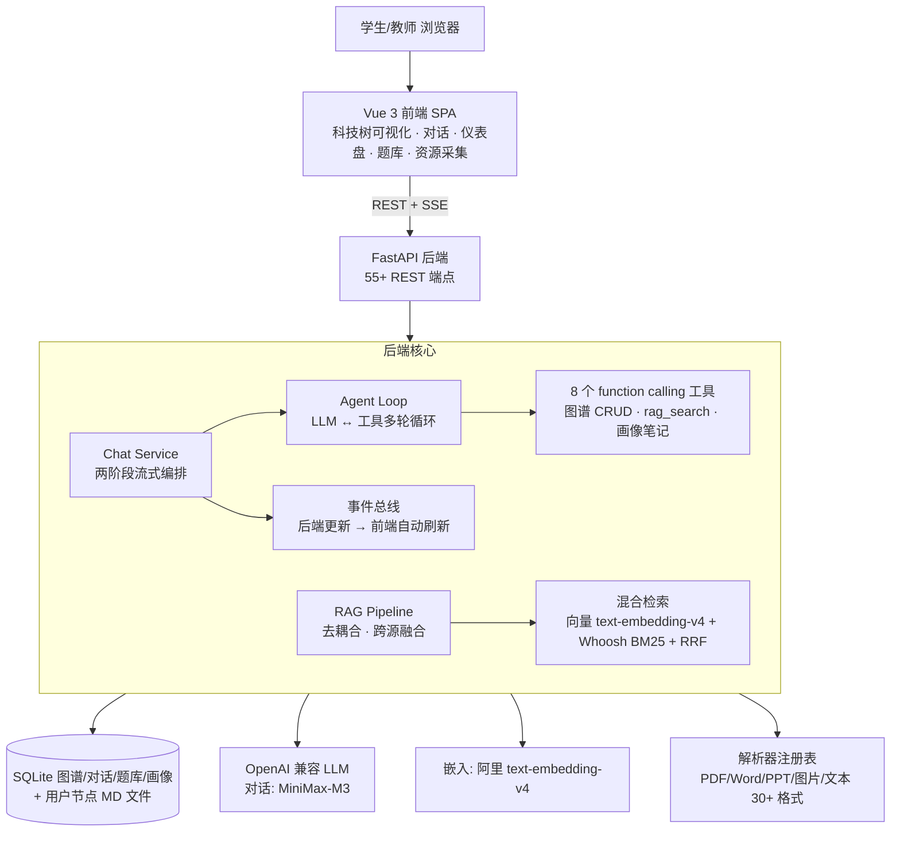

# TutorAgent 技术报告

## 知识图谱驱动的自适应导学 Agent

> 中国国际大学生创新大赛（2026）· 高教主赛道 · 本科生创意组 · 校评支撑材料
>
> 版本：v1（精简支撑版）｜ 日期：2026-09-07 ｜ 配套主文档：项目计划书 / 路演 PPT

---

## 1. 执行摘要

大模型已经进入大学生的日常学习，但"能快速得到答案"不等于"能独立学会"。TutorAgent 是一款面向大学生自主学习的导学系统：它以**知识图谱**为地图、以**学情画像**为记忆、以**学习路径**为导航、以**AI 出题与进度仪表盘**为反馈，把每一次对话变成"教学引导 + 图谱沉淀 + 掌握度更新 + 下一步规划"的完整闭环——**教、记、测、规**四件事在一轮交互中同时完成。

系统不直接给答案：全部教学模式统一走苏格拉底式追问、分步提示与检索式练习。这一设计有扎实的学习科学依据——Bastani et al.（2025）针对约 1,000 名学生的随机对照实验显示，直接给答案的 AI 组撤掉工具后成绩反比对照组低 17%，而引导式 AI 组无此负效应；主动检索的一周保留率（61%–81%）也显著高于被动重读（36%–40%，Karpicke & Roediger 2008, *Science*）。

当前产品已形成可运行的完整闭环，核心技术亮点为三：

| 编号 | 技术点 | 一句话价值 |
|:--:|---|----|
| T1 | 知识图谱自适应导学引擎 | 先修路径由 Kahn 拓扑排序保证无环，对话中的新知识自动沉淀为图谱节点 |
| T2 | 两阶段流式对话 Agent | 先流式回复、后后台调工具，回答流畅且图谱操作"无感知"完成 |
| T3 | 混合检索 RAG 管道 | 向量 + BM25 稀疏双路融合检索，带来源溯源，问答有据可依 |

系统现状：**55+ REST 端点、8 个 function calling 工具、250+ 自动化测试零网络全绿**，并提供离线评测集（256 文档 / 1000 查询）与 Docker 一键部署，工程化与测试完备性可支撑演示与进一步推广。

---

## 2. 背景与设计动机

### 2.1 问题：直接给答案，是主流 AI 学习工具的根源缺陷

通用 AI 工具（ChatGPT、豆包、Kimi 等）本质是"你问我答"：答案即时、流畅、完整——但正是这种流畅让学生跳过大脑的主动加工，教育学研究称之为"流畅错觉"。Bastani et al.（2025）的随机对照实验直接验证了这一风险：直接给答案的"GPT Base"组练习时成绩提升 48%，撤掉 AI 后反而低于对照组 17%，形成依赖陷阱；引导式提问的"GPT Tutor"组练习时提升 127%，撤掉 AI 后无负效应。

### 2.2 三大衍生痛点

| 痛点 | 表现 | TutorAgent 的对策 |
|---|---|---|
| 学习盲目碎片 | 只有孤立问答，不知道知识结构，学完串不起来 | 知识图谱呈现课程全景与先修关系 |
| 学完没有反馈 | 看不到掌握进度与薄弱点，复习靠感觉 | 掌握度 0–1 实时更新 + 薄弱点诊断 + 仪表盘 |
| 笔记与知识脱节 | 对话记录零散，无法复用 | 对话中的新知识自动沉淀为图谱节点，笔记即图谱 |

### 2.3 产品定位

聚焦高校学生**自主学习**场景（专业课自学、期末复习、碎片化积累），产品化"四有能力"：

> **有地图**（知识图谱）· **有路径**（拓扑学习路径）· **有记忆**（学情画像）· **有反馈**（AI 出题 + 进度仪表盘）

---

## 3. 系统总体架构

### 3.1 分层架构

【图 1】TutorAgent 系统总体架构

### 3.2 技术栈

| 层 | 选型 | 说明 |
|---|---|---|
| 前端 | Vue 3 + Vite + Pinia + Element Plus + D3.js | 力导向科技树、Markdown/LaTeX 渲染、暗色主题 |
| 后端 | Python FastAPI + Uvicorn（workers=1） | REST + SSE 流式，统一错误码，LLM 重试（指数退避+抖动） |
| 存储 | SQLite + 用户节点 MD 文件 | 零配置、按用户隔离（multi-tenant） |
| 检索 | text-embedding-v4 向量 + Whoosh BM25 → RRF 融合 | 宽召回各 30 → 融合 → top-5，带 path 溯源 |
| 解析 | PyMuPDF / python-docx / python-pptx / RapidOCR | 注册表 + 策略模式，可选依赖自动降级 |
| 部署 | Docker 单容器（Nginx:80 + Uvicorn:8000） | healthcheck + 数据卷 + SSE 反向代理 |

### 3.3 数据与安全

- **用户数据隔离**：图谱数据库、节点文件、画像、对话均按 `user_id` 隔离存储；
- **鉴权**：JWT（python-jose）+ bcrypt 密码哈希，接口级鉴权；
- **AI 权限边界**：区分 AI 创建与人工编辑，AI 不覆盖用户内容；资源采集内置**版权双模式**（个人合理使用 / 商用仅开放许可源），商用检索层自动过滤受限内容。

---

## 4. 核心技术创新

### 4.1 T1 知识图谱自适应导学引擎（差异化核心）

**解决什么**：学习碎片化与路径缺失。图谱以学科分组（学科 → 知识板块 → 节点三级），节点间以 `prerequisite`（先修）关系连边。

**怎么实现**：

- **路径规划**：Kahn 拓扑排序生成"从当前掌握点出发"的无环学习路径，BFS 环检测防止死循环依赖；
- **掌握度模型**：每个节点维护 0–1 掌握度（mastery），随对话与出题实时更新；薄弱节点在科技树中以醒目色 + 脉冲动画高亮，并同步进仪表盘统计；
- **对话即笔记**：教学对话中出现的新概念通过 `add_knowledge_node` / 内容更新工具自动沉淀为图谱节点，一轮对话结束图谱即生长一次；
- **切片机制**：Graph Middleware 支持全量 / 学科 / 板块按需切片，控制前端渲染与检索规模。

**创新在哪**：把"对话"从问答升级为对学习者认知结构的**持续构建**——图谱不是静态课件，而是随每个用户学习过程动态生长的个人知识资产；同时用事件总线把后台图谱更新推送前端，学生无感知看到知识树变化。

### 4.2 T2 两阶段流式对话 Agent（工程亮点）

**解决什么**：大模型工具调用延迟长，学生等待回答时容易流失；文本与图谱操作需要协同。

**怎么实现**：

- **Phase 1（先回）**：SSE 逐 token 推送教学回复（默认苏格拉底引导、按需分步提示，不直接给答案），首屏延迟低、阅读体验流畅；
- **Phase 2（后台做）**：回复流送完的同时，Agent Loop 在后台驱动 LLM 与 **8 个 function calling 工具**（图谱创建/更新/检索、`rag_search` 跨源检索、画像笔记）多轮循环，自动完成知识沉淀；
- **事件总线**：后台更新完成后经 SSE 事件推送前端，知识树/仪表盘自动刷新；
- **提示词外置**：全部教学提示词模板（Jinja2）独立存放，支持四模式（自适应引导 / 自由对话 / 递归式教学 / 路径推荐）切换。

**创新在哪**："先感受、后沉淀"的两阶段架构把大模型工具调用的延迟从交互路径中剥离，使教学系统的流畅性与"系统主动记录"能力兼得；Agent Loop + 事件总线实现了**一轮对话同时完成教、记、测、规**，这是通用问答工具"对话完即忘"所不具备的。

### 4.3 T3 混合检索 RAG 管道

**解决什么**：回答缺少资料依据、知识库难复用、图谱与上传教材两类知识源割裂。

**怎么实现**：

- **去耦合检索管道**：`RagSource` 协议抽象图谱源 / 知识库源 / 采集源，纯规则路由（问候、过短问题直接跳过检索），单源 8 秒超时 + 异常隔离，失败静默降级不影响对话；
- **混合检索**：向量（稠密，阿里 text-embedding-v4）+ Whoosh BM25（稀疏，自定义 CJK bigram 分词，不依赖 jieba）**双路各召回 30 → RRF 融合**，chunk 带目录 `path` 溯源并支持父级上下文扩展；
- **Agentic RAG**：检索注册为 `rag_search(query, source, top_k)` 工具，LLM 自主决定"何时查、查哪里（图谱/知识库/全部）"，回答带来源标注——检索不再是固定流程，而是智能体的能力；
- **中文优化**：Whoosh 无内置中文分析器，自研正则 CJK 切分 + bigram N-gram 过滤，实测中文检索可用。

**性能佐证**：Whoosh 批量入库经 `begin_deferred/flush` 优化，256 文档入库耗时 **180s → 4.7s（约 38 倍提速）**。

### 4.4 配套能力

- **AI 出题**：依据上传教材的混合检索结果自动生成单选/多选/判断/填空/简答，规则 + LLM 双路判分，结果回写题库并反哺掌握度；
- **学情画像 v2**：结构化 JSON（基础信息 / 目标 / 知识背景 / 学习偏好 / AI 笔记），10 字段完整度加权计算，画像随交互动态更新；
- **资源采集**：Wikipedia / Wikibooks / OI-wiki 适配器，断点续传入库，为"空学科"快速建图提供内容底座。

---

## 5. 质量保障与量化评测

### 5.1 三层测试体系

| 层 | 内容 | 状态 |
|---|---|---|
| 单元测试 | 分块 / 融合 / 父级扩展 / 路由 / 稀疏索引 / 图谱切片 / 出题 / 画像 / 计数等模块 | **254 项零网络全绿**（2026-09-07 校准，mock LLM/embedding，11s 级回归） |
| 集成测试 | 知识库上传-检索全链路、用户隔离、采集注册表与商用过滤、Agent Loop 循环 | 同上 |
| 离线评测 | CMRC2018 中文检索集：256 文档 / 1000 查询，`scripts/eval_rag.py` 一键复现 | 见 5.2 |

> 说明：另有真实 LLM 端到端用例（MiniMax-M3 对话/流式/工具调用）在有 API key 的部署环境单独运行，已验证端到端可通。

### 5.2 离线检索评测（mock 基线，诚实标注）

当前在 mock 弱向量下完成算法对照，用于**链路验证与算法选型**；真实 `text-embedding-v4` 评测将在账户额度恢复后以 `--embed api` 复跑并更新：

| 方法 | Recall@1 |
|---|:--:|
| 纯向量（mock 弱向量） | 0.470 |
| BM25 稀疏 | **0.964** |
| 混合（RRF 融合） | 0.766 |
| 混合（加权融合 α=0.6） | 0.818 |

结论：稀疏检索显著优于 mock 弱向量，混合融合的价值需在**真实 embedding** 下重新验证——这也是当前报告口径与后续真实评测的衔接点，不做夸大表述。

### 5.3 工程化与部署

- 一键脚本：`install.ps1` / `start.ps1`（Windows），Docker Compose 单容器部署（Linux），含 healthcheck 与数据卷；
- 健壮性：LLM 重试（指数退避 + 抖动）、全局异常处理、统一错误码、单源超时隔离、SSRF 防护、聊天接口限流；
- 可观测：Agent Loop 会话级 trace（`data/traces/`）用于复现与调试。

---

## 6. 创新性总结（与国创评审维度对照）

| 国创评审维度 | 本项目回应 |
|---|---|
| **教育维度** | 以学习科学实证（Bastani 2025 / Karpicke 2008）为方法论根基，产品行为即"主动学习"落地，不直接给答案 |
| **创新维度** | T1 动态个人知识图谱 + T2 两阶段流式 Agent + T3 双路混合 RAG 与 Agentic 检索，均为自研实现 |
| **团队维度** | 创始成员独立完成全栈闭环开发（前端 Vue / 后端 FastAPI / 检索 / 评测），文档与测试齐备，知识可交接 |
| **商业维度** | 低门槛"组织层"切入：学生可继续使用现有大模型/平台，TutorAgent 承担课程结构、进度反馈与复习安排（详见计划书） |
| **社会价值** | 面向 4,700 万在校大学生的自学刚需，促进 AI 从"替做"转向"会教"，回应 AI 教育产品依赖陷阱的公共议题 |

---

## 附录 A：术语表

| 术语 | 释义 |
|---|---|
| Agent（智能体） | 能自主调用工具、多轮决策完成任务的 AI 程序 |
| RAG（检索增强生成） | 先检索资料再生成回答，使回答有据可依 |
| 知识图谱 | 以"节点=知识点、边=先修关系"表达课程结构的数据模型 |
| 掌握度（mastery） | 0–1 的节点掌握评分，随交互实时更新 |
| 拓扑排序（Kahn） | 按先修关系排出无环学习顺序的图算法 |
| SSE | Server-Sent Events，服务器向浏览器单向推送的技术 |
| function calling | 让大模型按 JSON 声明调用外部工具的标准机制 |

---

*注：本报告为支撑材料精简版，与《项目计划书》互为补充——计划书回答"凭什么有人用、怎么盈利"，本报告回答"技术怎么做、为何可信"。数据口径以 2026-09-07 代码实测为准。*
