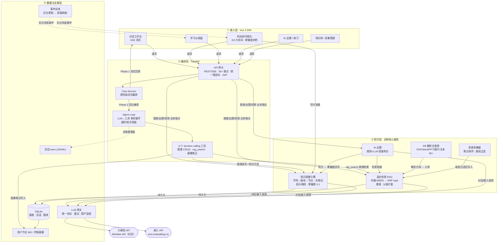

# PPT 脚本 · 技术全景单页图（所有技术细节 + 模块依赖关系）

> 用途：1 页 PPT 把 TutorAgent 全部技术模块讲清，并用一张"分层依赖图"说明模块间的分工与依赖。
> 适用：技术评审快速抓取全貌（路线图/架构页/答辩总览）。16:9。
> 配套：此页常作为技术部分首页，其后按需跟 2–3 张纵深页（图谱/Agent/RAG）。
> 数据口径：与 `../国创技术报告.md` 一致。

---

## 〇、页面目标

一张图回答三个问题：
1. **系统有几层、每层干什么**（接入 / 编排 / 知识 / 数据支撑）
2. **模块之间谁依赖谁**（箭头 = 依赖方向）
3. **自研的边界在哪**（虚线框外 = 外部模型 API；框内 = 全自研）

---

## 一、页面文字（可直接放进 PPT）

**大标题**：TutorAgent 技术全景 —— 分层自研 · 模块解耦 · 依赖清晰

**副标题（标题下一行小字）**：AI 只负责"说"（对话/嵌入，经统一网关可替换）；图谱、检索、出题、闭环全自研。

**顶部数字胶囊（4–5 枚，放标题与图之间）**：
`55+ REST 端点` ｜ `8 个 Agent 工具` ｜ `254 项测试全绿` ｜ `256 文档离线评测集` ｜ `30+ 文件格式解析`

---

## 二、主图：分层模块依赖图（Mermaid 源，复制到 mermaid.live 渲染）



**图例（图下方一行）**：
`实线 = 调用 / 数据流`　`点线 = 异步事件 / 日志`　`灰底框 = 外部 API（经网关可替换）`　`白框 = 自研`

---

## 三、口播脚本（约 90 秒）

> 这张图是 TutorAgent 的全部技术家底。四层，从外到里读：
>
> **第一层，接入层**——学生看到的就是一个 Vue 网页：对话工作台、用 D3 画的科技树、学习仪表盘、AI 出题、知识库上传，五个入口都走同一个后端。
>
> **第二层，编排层，这是系统的"大脑"**。所有请求先进 API 网关（55 个以上接口、统一鉴权和错误码），到 Chat Service 后做一件关键的事——**两阶段编排**：先用 SSE 把引导式回答一个字一个字推给学生，让学生不用等；同时把"该查什么、该记什么"交给后台的 **Agent Loop** 去跑。Agent Loop 让大模型在一个循环里自主决定调用哪个工具，我们注册了 8 个：查图谱、改图谱、跨源检索 rag_search、写画像笔记……
>
> **第三层，知识层，全部是自研服务，也是和"套壳问答"分界的核心**：知识图谱引擎管"课的结构和学生的掌握度"；混合检索 RAG 管"回答有出处"——向量和 BM25 双路召回再融合；解析注册表让老师上传 PDF、Word、PPT、甚至图片教材都能进库；AI 出题按教材自动出题并双路判分，把结果回写给图谱，更新掌握度；采集器给空白学科快速建库。
>
> **第四层，数据与支撑**：所有知识存 SQLite，按用户隔离；每个用户的笔记是独立文件；事件总线把后台的更新自动推到前端，所以图谱会自己长；LLM 网关统一接外部模型——大家注意图右侧，**真正用到的只有"对话"和"嵌入"两个外部 API**，且都走统一网关，想换哪个国产模型只改一行配置。
>
> 最后回应一个必问的问题：**这是不是套壳？** 看这张图就知道——外部只买了大模型的"嘴"和"眼睛"，从大脑（编排）到手脚（知识层）再到记忆（数据层）全是自研。外面是通用 AI，里面是一套完整的学习系统。

---

## 四、布局建议（WPS，16:9）

```
┌────────────────────────────────────────────────────────────┐
│ 页眉 TutorAgent · 国创2026        [标题 32-36pt 居中]        │
│ 副标题一行（小字）                                         │
│ ┌────────────────────────────────────────────────────────┐│
│ │  数字胶囊：55+端点｜8工具｜254测试｜256文档评测｜30+格式  ││
│ └────────────────────────────────────────────────────────┘│
│ ┌──────────────────────────────────────────────────────┐  │
│ │                                                       │  │
│ │              主图：分层模块依赖图（占 70% 面积）       │  │
│ │              四层分区用四种浅底色区分                  │  │
│ │                                                       │  │
│ │  ①接入层 Vue3       ③知识层(自研核心)                 │  │
│ │  ②编排层 FastAPI    ④数据/支撑层                       │  │
│ │  右侧灰底：大模型API（MiniMax-M3 / text-embedding-v4） │  │
│ └──────────────────────────────────────────────────────┘  │
│ 图例一行（实线/点线/灰底含义）                              │
│ 页码                                                      │
└────────────────────────────────────────────────────────────┘
```

**排版要点**：
- 四层 subgraph 分别用四种浅底色（如浅蓝/浅青/浅橙/浅灰），同色系随主色 #1F4E79 → #E67E22 递进；
- 右侧外部 API 用灰色胶囊单独悬浮，制造"外部 vs 自研"的视觉区隔；
- 正文字号 ≥ 11pt，评审是"走近看图"，宁可字小勿信息拥挤到箭头打架；
- 若 WPS 渲染 Mermaid 不便，改用手工矢量框图（见下节）。

---

## 五、在 WPS 里落地这张图的三种方式

| 方式 | 做法 | 适用 |
|---|---|---|
| ① mermaid.live 导出 | 复制上方源码 → mermaid.live → 粘贴 → 导出 **PNG（x4 倍率）** → 插入 PPT | 最省事，首选 |
| ② 本地 mmdc | 装 `@mermaid-js/mermaid-cli` 后命令行渲染 | 需本地环境 |
| ③ 手工矢量框图 | WPS 插入形状 → 圆角矩形分层 + 箭头 | 想逐字调样式时 |

> 提示：mermaid 源码保留在本文档，改模块后可随时重渲——建议图里内容变更时，回到本页更新源码再导一次。

---

## 六、依赖关系速查表（评审追问"谁依赖谁"时的标准答案）

| 依赖链 | 说明 | 为何这样设计 |
|---|---|---|
| 接入层 → API 网关 | 5 个前端入口只走后端 REST/SSE | 单一入口统一鉴权/错误码 |
| Chat Service → Agent Loop → 8 工具 | 对话不直接写库，全部走工具 | 工具可插拔、可单测、可审计 |
| rag_search 工具 → 混合检索 RAG | 模型自主决定何时检索、查哪源 | Agentic RAG，避免每问必查烧 token |
| 知识图谱引擎 → SQLite / 节点 MD | 图谱持久化 + 用户笔记文件 | 按用户隔离；MD 可人工直接改 |
| AI 出题 → 混合检索 + 掌握度回写 | 出题依据教材检索，判分写回图谱 | 形成"测→掌握度"反馈环 |
| KB 解析 → 分块入库 → RAG 索引 | 上传教材经解析注册表入检索库 | 30+ 格式统一转检索友好分块 |
| 事件总线 → 前端刷新 | 后台图谱更新完异步推前端 | 前后端解耦，用户"无感看到图谱生长" |
| LLM 网关 → MiniMax-M3 / text-embedding-v4 | 对话与嵌入统一走网关 | 厂商差异（思考标签等）隔离在网关，换模型不改业务 |
